# Fabric Engine Architecture

## Overview

Fabric is a C++20 cross-platform runtime for building interactive spatial and temporal applications. Programming primitives (vectors, timelines, events) compose into structural primitives (ECS worlds, chunked grids, coordinated graphs) that applications assemble into games, editors, or simulations. All engine symbols reside in the `fabric::` namespace across subdirectories organized by concern: core, ecs, fx, input, log, platform, render, resource, ui, utils, and world.

Recurse is a single-player voxel exploration game built on Fabric. It provides `main()` via `src/recurse/Recurse.cc`, registers 17 game systems through `FabricAppDesc`, and delegates execution to `FabricApp::run()`. All game symbols reside in the `recurse::` namespace. The namespace boundary rule is strict: `recurse::` depends on `fabric::`, never the reverse.

Rendering uses bgfx with Vulkan as the backend on all platforms. On macOS, Vulkan calls translate to Metal via MoltenVK. All shaders compile to SPIR-V; the bgfx `shaderc` tool produces embedded `.bin.h` headers consumed at compile time.

## Layer Architecture

```mermaid
graph TD
    subgraph L0["L0: Platform Abstraction"]
        SDL3["SDL3<br/>Windowing, input, timers"]
        bgfx["bgfx<br/>Vulkan rendering, SPIR-V"]
        WebView["WebView<br/>Embedded browser, JS bridge"]
        mimalloc["mimalloc<br/>Allocator (MI_OVERRIDE OFF)"]
    end

    subgraph L1["L1: Infrastructure"]
        Log["Log<br/>Quill async SPSC"]
        Profiler["Profiler<br/>Tracy abstraction"]
        Async["Async<br/>Standalone Asio, C++20 coroutines"]
        ErrorHandling["ErrorHandling<br/>FabricException"]
        StateMachine["StateMachine<br/>Guards, observers"]
        WriterQueue["WriterQueue<br/>MPSC serial executor"]
        ScopedTaskGroup["ScopedTaskGroup<br/>RAII future management"]
        ConfigManager["ConfigManager<br/>TOML config loading"]
    end

    subgraph L2["L2: Primitives"]
        Spatial["Spatial<br/>Type-safe vec/mat/quat, GLM bridge"]
        Temporal["Temporal<br/>Multi-timeline, snapshots"]
        Event["Event<br/>Typed thread-safe pub/sub"]
        Types["Types, JsonTypes"]
        FX["fx/<br/>Result, Error, OneOf, Never,<br/>WorldContext, WorldOps,<br/>SpatialDataOp, WorldQueryProvider"]
        Input["Input<br/>InputManager, InputRouter,<br/>InputAction, InputAxis,<br/>InputContext, InputSource"]
    end

    subgraph L3["L3: Structural"]
        ECS["ECS<br/>Flecs, ChildOf, CASCADE"]
        Resource["Resource, ResourceHub<br/>State machine, workers"]
        Camera["Camera<br/>Projection, view matrix"]
        Rendering["Rendering<br/>DrawCall, Geometry, Frustum, AABB"]
        Graphs["CoordinatedGraph"]
        BVH["BVH<br/>Median-split, frustum queries"]
        ChunkedGrid["ChunkedGrid<br/>Sparse infinite grid"]
        SceneView["SceneView<br/>Cull, render, Flecs queries"]
    end

    subgraph L4["L4: Framework"]
        AppLoop["FabricApp<br/>SDL3 events, fixed timestep"]
        SystemReg["SystemRegistry<br/>Kahn toposort, phase runners"]
        RmlUi["RmlUi<br/>BgfxRenderInterface, view 255"]
        PostProcess["PostProcess, PaniniPass"]
    end

    subgraph L5["L5: Application (recurse::)"]
        Recurse["Recurse<br/>main(), 17 systems, FabricAppDesc"]
    end

    L5 --> L4
    L4 --> L3
    L3 --> L2
    L2 --> L1
    L1 --> L0
```



Each layer depends only on layers below it. `recurse::` code at L5 depends on `fabric::` code at L0 through L4; the reverse dependency never occurs.

## Directory Structure

```
fabric/
├── include/
│   ├── fabric/                    # Engine headers (namespace fabric::)
│   │   ├── core/                  # AppContext, Event, Spatial, Temporal, SystemBase, SystemRegistry, etc.
│   │   ├── ecs/                   # ECS.hh (Flecs wrapper), Component.hh, WorldScoped.hh
│   │   ├── fx/                    # Result, Error, OneOf, Never, WorldContext, WorldOps, SpatialDataOp, WorldQueryProvider
│   │   ├── input/                 # InputManager, InputRouter, InputAction, InputAxis, InputContext, InputSource, InputSystem
│   │   ├── log/                   # Log.hh (Quill macros), FilteredConsoleSink, LogConfig
│   │   ├── platform/              # FabricApp, FabricAppDesc, ConfigManager, Async, ScopedTaskGroup, WriterQueue, JobScheduler, PlatformInfo, WindowDesc, CursorManager, DefaultConfig
│   │   ├── render/                # Camera, Rendering, DrawCall, Geometry, SceneView, ViewLayout, ShaderProgram, FullscreenQuad, PostProcess, PaniniPass, SkyRenderer, SpvOnly, BgfxHandle, HandleMap, BgfxCallback, RenderCaps
│   │   ├── resource/              # Resource, ResourceHub, AssetLoader, AssetRegistry, Handle
│   │   ├── ui/                    # BgfxRenderInterface, BgfxSystemInterface, ConcurrencyPanel, HotkeyPanel, RmlPanel, ToastManager, WebView
│   │   │   └── font/              # FontEngineInterfaceHarfBuzz, LanguageData
│   │   ├── utils/                 # BVH, CoordinatedGraph, ErrorHandling, Profiler, Testing, TextSanitize, Utils
│   │   └── world/                 # ChunkedGrid, ChunkCoord, ChunkCoordUtils
│   └── recurse/                   # Game headers (namespace recurse::)
│       ├── ai/                    # BehaviorAI, BTDebugPanel, Pathfinding
│       ├── animation/             # Animation, AnimationEvents, IKSolver, MeshLoader, SkinnedRenderer
│       ├── audio/                 # AudioSystem, ReverbZone, MaterialSounds
│       ├── character/             # CharacterController, FlightController, VoxelInteraction, MeleeSystem, MovementFSM, etc.
│       ├── components/            # EssenceTypes, StreamSource
│       ├── config/                # RecurseConfig
│       ├── input/                 # ActionIds, DebugToggleTable
│       ├── persistence/           # WorldSession, WorldTransactionStore, FchkCodec, ChunkStore, SqliteChunkStore, etc.
│       ├── physics/               # PhysicsWorld, JoltCharacterController, Ragdoll, VoxelCollision
│       ├── render/                # VoxelRenderer, OITCompositor, ShadowSystem, LODGrid, LODMeshManager, ParticleSystem, DebugDraw, etc.
│       ├── simulation/            # ChunkState, SimulationGrid, FallingSandSystem, MaterialRegistry, VoxelMaterial, etc.
│       ├── systems/               # 17 SystemBase subclasses (one per game system)
│       ├── ui/                    # DebugHUD, ContentBrowser, DevConsole, ChunkDebugPanel, LODStatsPanel, WAILAPanel
│       └── world/                 # ChunkOps, ChunkStreaming, WorldGenerator, VoxelMesher, TerrainGenerator, etc.
├── src/
│   ├── core/                      # Engine source: Event, Spatial, Temporal, SystemRegistry, etc.
│   ├── fabric/                    # Engine source by subsystem
│   │   ├── ecs/
│   │   ├── input/
│   │   ├── log/
│   │   ├── platform/
│   │   ├── render/
│   │   ├── resource/
│   │   └── ui/
│   ├── platform/                  # CursorManager, PlatformInfo, WindowDesc
│   ├── ui/                        # BgfxRenderInterface, BgfxSystemInterface, panels, WebView
│   ├── utils/                     # ErrorHandling, Utils
│   └── recurse/                   # Game source files
│       ├── Recurse.cc             # main() entry point
│       ├── ai/, animation/, audio/, character/, components/, config/
│       ├── persistence/, physics/, render/, simulation/, systems/, ui/, world/
├── shaders/                       # bgfx .sc shader sources
│   ├── oit/                       # OIT accumulation and composite
│   ├── panini/                    # Panini projection
│   ├── particle/                  # Particle billboard rendering
│   ├── post/                      # Bloom pipeline (bright, blur, tonemap)
│   ├── rmlui/                     # UI overlay
│   ├── shared/                    # Shared varying definitions (fullscreen, voxel lighting)
│   ├── skinned/                   # GPU skeletal mesh skinning
│   ├── sky/                       # Procedural atmosphere
│   └── voxel-lighting/            # Voxel chunk terrain with lighting
├── tests/
│   ├── unit/                      # Unit tests (core/, fx/, persistence/, platform/, simulation/, ui/, utils/, world/)
│   ├── e2e/                       # End-to-end tests
│   ├── fixtures/                  # Test fixture data
│   └── TestMain.cc                # Shared main() with Quill init
├── config/
│   ├── fabric.toml                # Engine defaults (window, renderer, logging)
│   └── recurse.toml               # Game defaults (terrain, LOD, pipeline, physics, audio, panini)
├── cmake/
│   ├── CPM.cmake                  # CPM.cmake v0.42.1
│   ├── modules/                   # 33 CMake modules (dependency + shader targets)
│   └── patches/                   # Vendored dependency patches
├── docs/                          # Architecture, API reference, guides
├── tasks/                         # Shell (.sh) and PowerShell (.ps1) task scripts
├── assets/                        # Runtime assets (UI .rml/.rcss files)
├── CMakeLists.txt
├── CMakePresets.json              # Configure presets (dev + CI + sanitize + coverage)
├── mise.toml                      # Task runner (build, test, lint, profile, analysis)
└── mise.windows.toml              # Windows environment overrides
```

## Build System

The build uses CMake with CPM.cmake v0.42.1 for dependency management and mise as the task runner.

### Library Targets

| Target | Type | Contents |
|--------|------|----------|
| FabricLib | STATIC | Engine sources only (fabric:: namespace) |
| RecurseGame | OBJECT | Game sources only (recurse:: namespace) |

Both libraries link into the three executables: Recurse, UnitTests, and E2ETests.

### Shader Targets

Shader `.sc` files compile to SPIR-V embedded `.bin.h` headers via bgfx `shaderc`. The 8 shader targets split across the two library targets:

| Depends On FabricLib | Depends On RecurseGame |
|----------------------|------------------------|
| FabricRmlUiShaders | FabricSkinnedShaders |
| FabricSkyShaders | FabricSmoothShaders |
| FabricPostShaders | FabricParticleShaders |
| FabricPaniniShaders | FabricOITShaders |

### Executables

| Target | Entry Point |
|--------|-------------|
| Recurse | `src/recurse/Recurse.cc` |
| UnitTests | `tests/TestMain.cc` (GoogleTest) |
| E2ETests | `tests/TestMain.cc` (GoogleTest) |

### Build Presets

The default development preset is `dev-debug`, which places output in `build/dev-debug/`. Additional presets for CI, sanitizers, and coverage are defined in `CMakePresets.json`. To build and run:

```sh
mise run build          # cmake --build (dev-debug preset)
mise run test           # ctest
```

## System Registration and Lifecycle

### FabricAppDesc Pattern

Recurse constructs a `FabricAppDesc`, registers 17 game systems via `desc.registerSystem<T>(phase)`, and passes the descriptor to `FabricApp::run()`. Each system is a subclass of `fabric::SystemBase` and implements `init()`, `shutdown()`, and one of `fixedUpdate()`, `update()`, or `render()`. Dependencies between systems are declared in `configureDependencies()` using `after<T>()` and `before<T>()` constraints.

### Dependency Resolution

`SystemRegistry` resolves inter-system dependencies globally across all phases using Kahn's algorithm (topological sort), then derives per-phase execution order as a filtered subsequence of the global ordering. Registration order does not determine execution order; the toposort does. Cross-phase `after<T>()`/`before<T>()` edges affect the global ordering and init/shutdown sequence. Circular dependencies are detected at registration time and cause a fatal error.

### 9-Phase Application Lifecycle

`FabricApp::run()` owns the entire application lifecycle. All state is local to `run()`; there are no member variables or singletons.

| Phase | Description |
|-------|-------------|
| 1. Bootstrap | Parse CLI arguments, init logging (Quill) |
| 2. Platform Init | SDL_Init, PlatformInfo::populate(), config loading, window creation, bgfx::init() |
| 3. Infrastructure | Create AppContext, ECS world, Timeline, EventDispatcher, ResourceHub, SystemRegistry |
| 4. System Registration | Execute FabricAppDesc system factories (registerSystem calls) |
| 5. Dependency Resolution | Global Kahn toposort, then per-phase filtering |
| 6. System Init | Call init() on all systems in dependency order (wrapped in try-catch) |
| 7. Application Init | Execute FabricAppDesc::onInit callback (key bindings, ECS setup) |
| 8. Main Loop | Fixed timestep loop: SDL events, phase runners (PreUpdate through PostRender) |
| 9. Shutdown | Systems shutdown in reverse order, bgfx shutdown, SDL_Quit |

### System Phases

The main loop dispatches systems across seven phases. FixedUpdate runs N times per frame at a fixed timestep; all other phases run once per frame.

| Phase | Cadence | Purpose |
|-------|---------|---------|
| PreUpdate | Per frame | Input polling, event dispatch, mode transitions |
| FixedUpdate | N per frame | Physics, AI, simulation at fixed timestep |
| Update | Per frame | Camera, audio, per-frame logic |
| PostUpdate | Per frame | Post-simulation cleanup, state sync |
| PreRender | Per frame | Meshing, shadow cascades, LOD selection |
| Render | Per frame | Scene submission, voxel rendering, particles |
| PostRender | Per frame | UI overlay, debug HUD, frame flip |

### System Execution Graph

Recurse registers 17 systems across four phases. Systems without declared dependencies may execute in any order within their phase.

| Phase | Systems |
|-------|---------|
| FixedUpdate (8) | TerrainSystem, VoxelSimulationSystem, PhysicsGameSystem, CharacterMovementSystem, AIGameSystem, ParticleGameSystem, ChunkPipelineSystem, VoxelInteractionSystem |
| Update (3) | MainMenuSystem, AudioGameSystem, CameraGameSystem |
| PreRender (3) | VoxelMeshingSystem, LODSystem, ShadowRenderSystem |
| Render (3) | VoxelRenderSystem, OITRenderSystem, DebugOverlaySystem |

The primary FixedUpdate dependency chain is: TerrainSystem -> ChunkPipelineSystem -> VoxelSimulationSystem -> PhysicsGameSystem -> CharacterMovementSystem -> VoxelInteractionSystem. AIGameSystem and ParticleGameSystem have no declared dependencies; the toposort places them at any valid position within the phase. ChunkPipelineSystem reads the previous tick's player position from CharacterMovementSystem (intentional one-tick lag for streaming).

## Namespace Table

| Namespace | Subdirectory | Key Types |
|-----------|-------------|-----------|
| `fabric::` | `core/` | AppContext, Event, Spatial, Temporal, SystemBase, SystemRegistry, SystemPhase, StateMachine, WorldLifecycle, AppModeManager, RuntimeState |
| `fabric::ecs` | `ecs/` | ECS (Flecs wrapper), Component, WorldScoped |
| `fabric::fx` | `fx/` | Result, Error, OneOf, Never, WorldContext, WorldOps, SpatialDataOp, WorldQueryProvider |
| `fabric::input` | `input/` | InputManager, InputRouter, InputAction, InputAxis, InputContext, InputSource, InputSystem |
| `fabric::log` | `log/` | Log (init/shutdown, FABRIC_LOG_INFO), FilteredConsoleSink, LogConfig |
| `fabric::platform` | `platform/` | FabricApp, FabricAppDesc, ConfigManager, Async, ScopedTaskGroup, WriterQueue, JobScheduler, PlatformInfo |
| `fabric::render` | `render/` | Camera, Rendering, DrawCall, Geometry, SceneView, ViewLayout, ShaderProgram, PostProcess, PaniniPass, SkyRenderer, BgfxHandle |
| `fabric::render::view` | `render/ViewLayout.hh` | K_SKY, K_GEOMETRY, K_TRANSPARENT, K_PARTICLES, K_POST_BASE, K_PANINI, K_OIT_ACCUM, K_SHADOW_BASE, K_UI |
| `fabric::resource` | `resource/` | Resource, ResourceHub, AssetLoader, AssetRegistry, Handle |
| `fabric::ui` | `ui/` | BgfxRenderInterface, BgfxSystemInterface, ConcurrencyPanel, HotkeyPanel, RmlPanel, ToastManager, WebView |
| `fabric::Utils` | `utils/` | BVH, CoordinatedGraph, ErrorHandling, Profiler, Testing, TextSanitize |
| `recurse::` | (various) | TerrainGenerator, PhysicsWorld, WorldSession, VoxelRenderer, ChunkState, BehaviorAI, RecurseConfig |
| `recurse::systems` | `systems/` | 17 SystemBase subclasses (TerrainSystem, VoxelRenderSystem, etc.) |
| `recurse::input` | `input/` | ActionIds (K_ACTION_MOVE_FORWARD, etc.), DebugToggleTable |
| `recurse::simulation` | `simulation/` | ChunkState, SimulationGrid, FallingSandSystem, MaterialRegistry, VoxelMaterial |

The dependency direction is strictly one-way: `recurse::` depends on `fabric::`, never the reverse.

## Key Architectural Patterns

### Ops-as-Values (WorldContext resolve/submit)

World operations are modeled as value types (`SyncReadOp`, `AsyncMutationOp`) that describe intent without performing side effects. Systems construct op values and pass them to `WorldContext::resolve()` for synchronous reads or `WorldContext::submit()` for asynchronous mutations. This separates what a system wants to do from how and when the operation executes, enabling batching, reordering, and transactional grouping.

### Phantom Type-State (ChunkState, ChunkRef)

Chunk lifecycle stages (Empty, Generating, Generated, Meshing, Meshed, Active, Unloading) are represented as phantom type parameters on `ChunkRef<State>`. Transitions between states are enforced at compile time; a function accepting `ChunkRef<Generated>` cannot receive a chunk in any other state. The `ChunkState` enum mirrors these states at runtime for serialization and debugging.

### WorldSession RAII

`WorldSession` owns all per-world resources: the SQLite database, chunk stores, transaction store, simulation grid, and streaming state. Its destructor tears down resources in a fixed order to prevent use-after-free across subsystems. `WorldSession::open()` returns a `Result<unique_ptr<WorldSession>, IOError>`, making failure explicit. The session also owns persistence scheduling (snapshots, pruning) and coordinates world begin/end lifecycle events.

### WorldAware Lifecycle (HasWorldBegin/HasWorldEnd)

The `HasWorldBegin` and `HasWorldEnd` concepts in `WorldLifecycle.hh` detect whether a system implements `onWorldBegin()` or `onWorldEnd()` methods. `WorldLifecycleCoordinator` iterates registered systems and calls these methods when a world session opens or closes, without requiring systems to register manually for world events.

### ScopedTaskGroup

`ScopedTaskGroup` is a generic RAII container for managing a set of `std::future` objects. It tracks in-flight async tasks by key, supports polling for completion, and cancels all outstanding futures on destruction. Both a primary template (with metadata per task) and a void-metadata specialization exist.

### WriterQueue

`WriterQueue` is an MPSC (multi-producer, single-consumer) serial executor. Producers submit callables from any thread; a dedicated consumer thread drains the queue and executes tasks in FIFO order. The primary use case is serializing SQLite write operations so that multiple systems can enqueue writes without external locking.

## Shader Pipeline

### Directory Layout

Shader sources live under `shaders/`, organized by pass:

| Directory | Pass |
|-----------|------|
| `oit/` | Order-independent transparency (accumulation + composite) |
| `panini/` | Panini projection distortion correction |
| `particle/` | Billboard particle instancing |
| `post/` | Bloom pipeline (bright extract, Gaussian blur, ACES tonemap) |
| `rmlui/` | UI overlay rendering |
| `shared/` | Shared varying definitions (fullscreen triangle, voxel lighting) |
| `skinned/` | GPU skeletal mesh skinning |
| `sky/` | Procedural atmosphere (Preetham model) |
| `voxel-lighting/` | Voxel chunk terrain with per-vertex lighting |

### SPIR-V Compilation

All shaders are `.sc` files (bgfx shader language). The CMake build invokes `shaderc` to compile each shader to SPIR-V, producing embedded C headers (`*.bin.h`). These headers are `#include`d directly into C++ source files via `createProgramFromEmbedded()`. Non-SPIR-V backends are suppressed by `SpvOnly.hh`.

### View ID Layout

bgfx uses integer view IDs (0 through 255) to order render passes. All view ID constants are defined in `fabric/render/ViewLayout.hh` with `static_assert` overlap validation:

| View ID | Pass |
|---------|------|
| 0 | Sky |
| 1 | Geometry (opaque voxel chunks, skinned meshes) |
| 2 | Transparent |
| 10 | Particles |
| 200-204 | PostProcess (bright, blur, tonemap) |
| 206 | Panini projection |
| 210-211 | OIT (accumulation, composite) |
| 240-243 | Shadow cascades |
| 255 | UI (RmlUi overlay) |

## Persistence

### SQLite Per-World Storage

Each game world uses its own SQLite database in WAL (Write-Ahead Logging) mode. `SqliteChunkStore` handles chunk reads and writes, including WAL checkpointing on clean shutdown. The `WriterQueue` serializes all database writes from multiple threads onto a single consumer thread.

### WorldTransactionStore

`WorldTransactionStore` provides change logging on top of chunk storage. It records voxel modifications as transactions, supports periodic snapshots via `SnapshotScheduler`, rollback via `RollbackExecutor`, and history pruning via `PruningScheduler`. These components compose inside `WorldSession`.

### FchkCodec

`FchkCodec` encodes and decodes voxel chunk data for storage. It supports three compression modes: none (0), zstd (1), and LZ4 (2). The codec is used by `SqliteChunkStore` when reading and writing chunk blobs.

## Configuration

### 5-Layer TOML Configuration

Configuration loads in ascending precedence:

| Layer | Source | Scope |
|-------|--------|-------|
| 1. Compiled defaults | `DefaultConfig.hh` constants | Fallback values |
| 2. `config/fabric.toml` | Engine config file | Renderer, platform, logging |
| 3. `config/recurse.toml` | Application config file | Terrain, LOD, pipeline, physics, audio, panini |
| 4. `user.toml` | Platform-standard user path | Persistent user preferences |
| 5. CLI flags | Command-line arguments | Override everything |

`ConfigManager` merges these layers at startup. `RecurseConfig` is a runtime struct loaded from `recurse.toml` via `RecurseConfig::loadFromConfig()`, with constexpr defaults as fallbacks.

### RuntimeState

A transient `RuntimeState` struct holds non-persistent system state (resize events, DPI changes, debug flags). RuntimeState is not written to disk and not part of the configuration hierarchy.

## Testing

Tests use GoogleTest with a shared `TestMain.cc` that initializes Quill logging.

| Target | Location | Scope |
|--------|----------|-------|
| UnitTests | `tests/unit/` | CPU-side logic (core, fx, persistence, platform, simulation, ui, utils, world) |
| E2ETests | `tests/e2e/` | Integration tests spanning multiple subsystems |

Test fixtures live in `tests/fixtures/`. Unit tests run against a bgfx noop backend; there is no GPU-side render state validation in CI.

```sh
mise run test           # run unit tests
mise run test:e2e       # run E2E tests
mise run test:all       # run unit + E2E tests
```
