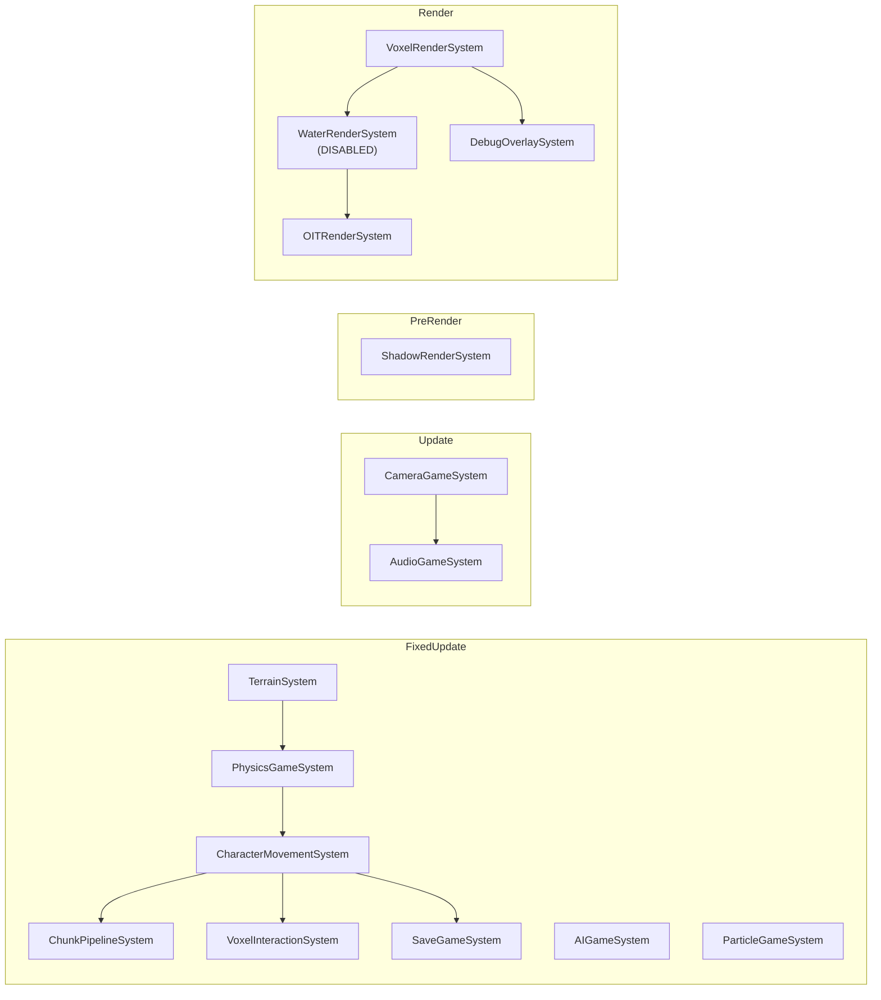
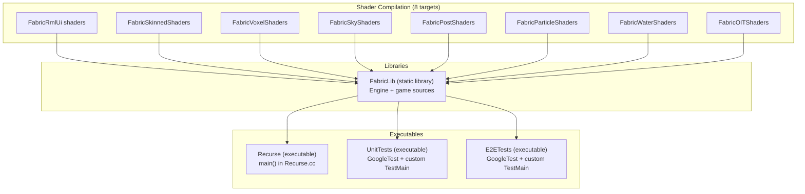

# Fabric Engine Architecture

## Overview

Fabric is a C++20 cross-platform runtime for building interactive spatial-temporal applications. Programming primitives (math, time, events, commands) compose into structural primitives (scenes, entities, graphs, simulations) that applications use to create games, editors, simulations, and multimedia tools. All engine symbols reside in the `fabric::` namespace.

Recurse is a single-player voxel exploration game built on Fabric. It provides `main()` via `src/recurse/Recurse.cc`, registers 15 application systems through `FabricAppDesc`, and delegates execution to `FabricApp::run()`. All game symbols reside in the `recurse::` namespace.

Rendering uses Vulkan on all platforms. macOS translates Vulkan calls to Metal via MoltenVK. All shaders compile to SPIR-V.

## Layer Architecture

```mermaid
graph TD
    subgraph L0["L0: Platform Abstraction"]
        SDL3["SDL3 3.4.2<br/>Windowing, input, timers"]
        bgfx["bgfx 1.139.9155<br/>Vulkan rendering, SPIR-V"]
        WebView["WebView 0.12.0<br/>Embedded browser, JS bridge"]
        mimalloc["mimalloc 2.2.7<br/>Allocator (MI_OVERRIDE OFF)"]
    end

    subgraph L1["L1: Infrastructure"]
        Log["Log<br/>Quill async SPSC"]
        Profiler["Profiler<br/>Tracy abstraction"]
        Async["Async<br/>Standalone Asio, C++20 coroutines"]
        ErrorHandling["ErrorHandling<br/>FabricException, Result&lt;T&gt;"]
        StateMachine["StateMachine<br/>Guards, observers"]
    end

    subgraph L2["L2: Primitives"]
        Spatial["Spatial<br/>Type-safe vec/mat/quat, GLM bridge"]
        Temporal["Temporal<br/>Multi-timeline, snapshots"]
        Event["Event<br/>Typed thread-safe pub/sub"]
        Command["Command<br/>Undo/redo, composite"]
        Pipeline["Pipeline<br/>Multi-stage data processing"]
        Types["Types, JsonTypes"]
        Codec["Codec (L2.5)<br/>Encode/decode pipeline"]
    end

    subgraph L3["L3: Structural"]
        ECS["ECS<br/>Flecs v4.1.4, ChildOf, CASCADE"]
        Resource["Resource, ResourceHub<br/>State machine, workers"]
        Camera["Camera<br/>Projection, view matrix"]
        Rendering["Rendering<br/>AABB, Frustum, DrawCall"]
        Graphs["CoordinatedGraph, ImmutableDAG"]
        BVH["BVH<br/>Median-split, frustum queries"]
        VoxelWorld["Voxel World<br/>ChunkedGrid, FieldLayer, Mesher"]
        Character["Character, Physics, AI, Audio"]
        AnimRender["Animation, Rendering Pipeline"]
        Simulation["Simulation, Persistence"]
    end

    subgraph L4["L4: Framework"]
        AppLoop["FabricApp<br/>SDL3 events, fixed timestep"]
        SceneView["SceneView<br/>Cull, render, Flecs queries"]
        RmlUi["RmlUi<br/>BgfxRenderInterface, view 255"]
        SystemReg["SystemRegistry<br/>Kahn toposort, phase runners"]
    end

    subgraph L5["L5: Application"]
        Recurse["Recurse<br/>main(), 15 systems, FabricAppDesc"]
    end

    L5 --> L4
    L4 --> L3
    L3 --> L2
    L2 --> L1
    L1 --> L0
```



Each layer depends only on layers below it. `recurse::` code at L5 depends on `fabric::` code at L0 through L4; the reverse dependency never occurs.

## System Registration and Lifecycle

### FabricAppDesc Pattern

Recurse constructs a `FabricAppDesc`, registers 15 game systems via `desc.registerSystem<T>(phase)`, and passes the descriptor to `FabricApp::run()`. Each system is a subclass of `fabric::SystemBase` and implements `init()`, `shutdown()`, and one of `fixedUpdate()`, `update()`, or `render()`. Dependencies between systems are declared in `configureDependencies()` using `after<T>()` and `before<T>()` constraints.

### Dependency Resolution

`SystemRegistry` resolves inter-system dependencies within each phase using Kahn's algorithm (topological sort). Registration order does not determine execution order; the toposort does. Circular dependencies are detected at registration time and cause a fatal error.

### 9-Phase Application Lifecycle

`FabricApp::run()` owns the entire application lifecycle. All state is local to `run()`; there are no member variables or singletons.

| Phase | Description |
|-------|-------------|
| 1. Bootstrap | Parse CLI arguments, init logging (Quill) |
| 2. Platform Init | SDL_Init, PlatformInfo::populate(), config loading, window creation, bgfx::init() |
| 3. Infrastructure | Create AppContext, ECS world, Timeline, EventDispatcher, ResourceHub, SystemRegistry |
| 4. System Registration | Execute FabricAppDesc system factories (registerSystem calls) |
| 5. Dependency Resolution | Kahn toposort within each SystemPhase |
| 6. System Init | Call init() on all systems in dependency order (wrapped in try-catch) |
| 7. Application Init | Execute FabricAppDesc::onInit callback (key bindings, ECS setup) |
| 8. Main Loop | Fixed timestep loop: SDL events, phase runners (PreUpdate through PostRender) |
| 9. Shutdown | Systems shutdown in reverse order, bgfx shutdown, SDL_Quit |

### System Phases

The main loop dispatches systems across seven phases. FixedUpdate runs N times per frame at a fixed timestep; all other phases run once per frame.

| Phase | Cadence | Purpose |
|-------|---------|---------|
| PreUpdate | Per frame | Input polling, event dispatch, mode transitions |
| FixedUpdate | N per frame | Physics, AI, simulation at fixed timestep |
| Update | Per frame | Camera, audio, per-frame logic |
| PostUpdate | Per frame | Post-simulation cleanup, state sync |
| PreRender | Per frame | Shadow cascades, LOD selection, culling |
| Render | Per frame | Scene submission, voxel rendering, particles |
| PostRender | Per frame | UI overlay, debug HUD, frame flip |

## System Execution Graph



AIGameSystem and ParticleGameSystem run in FixedUpdate but have no declared dependencies on other application systems; the toposort places them at any valid position within the phase.

WaterRenderSystem is registered but disabled at runtime pending a VP0 rewrite (Noita-inspired voxel water). The current water simulation consumes 180ms/frame due to an O(total_water_cells) `collectActiveCells` scan.

## Rendering Pipeline

### View ID Budget

bgfx uses integer view IDs to order render passes. Fabric allocates view IDs across a 0 through 255 range:


| View ID | Pass | Notes |
|---------|------|-------|
| 0 | Sky | SkyRenderer procedural atmosphere |
| 1 | Geometry | Opaque voxel chunks, skinned meshes |
| 2 | Transparent | Alpha-sorted transparent geometry |
| 10 | Particles | Billboard particle instancing |
| 200-204 | PostProcess | Bright extract, Gaussian blur, tonemap (dormant) |
| 210 | OIT Accumulation | RGBA16F weighted blended accumulation |
| 211 | OIT Composite | Revealage resolve |
| 240+ | Shadows | Cascaded shadow maps with texel snapping |
| 255 | UI | RmlUi overlay (BgfxRenderInterface) |

### Framebuffer Topology

OIT uses a two-pass MRT: an accumulation pass writes to RGBA16F (weighted color) and R8 (revealage) targets at view 210, then a composite pass at view 211 blends the result into the backbuffer. PostProcess (bloom pipeline: bright extract, Gaussian blur, ACES tonemap) is implemented but dormant; `initPrograms()` only creates `brightProgram_` and skips the remaining two.

## Build Target Graph



FabricLib is a single static library containing all engine and game sources. Shader `.sc` files compile to SPIR-V embedded `.bin.h` headers via bgfx `shaderc`. FabricLib depends on all 8 shader targets so that embedded headers exist before C++ compilation.

## Directory Structure

```
fabric/
├── include/
│   ├── fabric/                    # Engine headers (namespace fabric::)
│   │   ├── core/                  # Core systems: ECS, Event, Camera, Audio, Physics, AI, etc.
│   │   ├── codec/                 # Encode/decode pipeline
│   │   ├── parser/                # ArgumentParser, SyntaxTree, Token
│   │   ├── platform/              # WindowDesc, PlatformInfo, CursorManager
│   │   ├── ui/                    # BgfxRenderInterface, BgfxSystemInterface, DebugHUD, WebView
│   │   └── utils/                 # BVH, BufferPool, CoordinatedGraph, ErrorHandling, Profiler
│   └── recurse/                   # Game headers (namespace recurse::)
│       ├── ai/                    # BehaviorAI, Pathfinding
│       ├── animation/             # Animation, AnimationEvents, IKSolver, SkinnedRenderer
│       ├── audio/                 # AudioSystem, ReverbZone, MaterialSounds
│       ├── gameplay/              # CharacterController, FlightController, VoxelInteraction, Melee
│       ├── persistence/           # SaveManager, DataLoader
│       ├── physics/               # PhysicsWorld, Ragdoll
│       ├── render/                # SkyRenderer, WaterRenderer, OITCompositor, PostProcess, etc.
│       ├── systems/               # 15 SystemBase subclasses (one per game system)
│       ├── ui/                    # InputRouter, ToastManager, ContentBrowser
│       └── world/                 # ChunkedGrid, ChunkStreaming, TerrainGenerator, VoxelMesher, etc.
├── src/
│   ├── core/                      # Engine source files
│   ├── codec/
│   ├── parser/
│   ├── ui/
│   ├── utils/
│   └── recurse/                   # Game source files (mirrors include/recurse/ subdirectories)
│       ├── Recurse.cc             # main() entry point
│       ├── ai/, animation/, audio/, gameplay/, persistence/
│       ├── physics/, render/, systems/, ui/, world/
├── shaders/                       # bgfx .sc shader sources
│   ├── oit/                       # OIT accumulation and composite
│   ├── particle/                  # Particle billboard rendering
│   ├── post/                      # Bloom pipeline (bright, blur, tonemap)
│   ├── rmlui/                     # UI overlay
│   ├── skinned/                   # GPU skeletal mesh skinning
│   ├── sky/                       # Procedural sky
│   ├── voxel/                     # Voxel chunk terrain
│   └── water/                     # Water surface
├── tests/
│   ├── unit/                      # Unit tests (codec/, core/, parser/, ui/, utils/)
│   ├── e2e/                       # End-to-end tests
│   └── TestMain.cc                # Shared main() with Quill init
├── cmake/
│   ├── CPM.cmake                  # CPM.cmake v0.42.1
│   ├── modules/                   # 25 CMake modules (dependency + shader targets)
│   └── patches/                   # Vendored dependency patches
├── tasks/                         # Shell (.sh) and PowerShell (.ps1) task scripts
├── assets/                        # Runtime assets (UI .rml/.rcss files)
├── CMakeLists.txt
├── CMakePresets.json              # 12 configure presets (dev + CI + sanitize + coverage)
├── mise.toml                      # Task runner (build, test, lint, profile, analysis)
└── mise.windows.toml              # Windows environment overrides
```

## Namespace Conventions

| Namespace | Scope | Examples |
|-----------|-------|---------|
| `fabric::` | Engine types, components, utilities | `fabric::Event`, `fabric::Camera`, `fabric::FabricApp` |
| `fabric::log` | Logging subsystem | `fabric::log::init()`, `FABRIC_LOG_INFO(...)` |
| `fabric::async` | Async I/O subsystem | `fabric::async::init()`, `fabric::async::makeStrand()` |
| `fabric::Utils` | General utilities | `fabric::Utils::generateUniqueId()` |
| `fabric::Testing` | Test utilities | `fabric::Testing::MockComponent` |
| `recurse::` | Game-specific types | `recurse::TerrainGenerator`, `recurse::PhysicsWorld` |
| `recurse::systems` | SystemBase subclasses | `recurse::systems::TerrainSystem` |

The dependency direction is strictly one-way: `recurse::` depends on `fabric::`, never the reverse.

## Configuration

### 5-Layer TOML Configuration

Configuration loads in ascending precedence:

| Layer | Source | Scope |
|-------|--------|-------|
| 1. Compiled defaults | Hardcoded in engine | Fallback values |
| 2. `fabric.toml` | Engine config file | Renderer, platform, logging |
| 3. `recurse.toml` | Application config file | Window size, FOV, timestep, initial mode |
| 4. `user.toml` | Platform-standard user path | Persistent user preferences |
| 5. CLI flags | Command-line arguments | Override everything |

User preferences persist to platform-standard locations: `~/.config/fabric/user.toml` on Linux, `~/Library/Application Support/Fabric/` on macOS, `%APPDATA%/Fabric/` on Windows.

### RuntimeState

A transient `RuntimeState` struct holds non-persistent system state (resize events, DPI changes, debug flags). RuntimeState is not written to disk and not part of the configuration hierarchy.

## Known Limitations

1. **Water system disabled**: WaterRenderSystem is registered but disabled at runtime. The water simulation consumes 180ms/frame due to O(total_water_cells) scanning in `collectActiveCells`. Architecture requires a full rewrite (VP0, Noita-inspired voxel water).

2. **PostProcess dormant**: The bloom pipeline (`initPrograms()`) only creates `brightProgram_`; the blur and tonemap programs are never initialized. PostProcess is disabled by default. Fix deferred to VP0 HDR pipeline work.

3. **Visual bugs partially fixed**: BUG-LIGHTSTREAK (uniform consumed by DISCARD_ALL) and BUG-CHUNKFACE (LOD neighbor dirtying) have code fixes applied but unconfirmed at runtime. Validation requires a render state inspection layer that does not yet exist.

4. **Memory usage approximately 500MB**: Cause unconfirmed. Suspected contributors: 14 worker thread stacks, chunk density/essence field allocations, bgfx Metal resource pool.

5. **OIT double-init**: OITCompositor initializes twice at startup (duplicate bgfx uniforms), likely from a spurious `SDL_EVENT_WINDOW_PIXEL_SIZE_CHANGED` on the first frame.

6. **Missing .rml assets at runtime**: DebugHUD, BTDebugPanel, and DevConsole fail to load `.rml` files because the build binary runs from `build/dev-debug/bin/` while assets live in the source tree.

7. **4 AppContext optional fields never wired**: `inputSystem`, `platformInfo`, `renderCaps`, and `cursorManager` are declared in AppContext but never populated in `FabricApp::run()`.

8. **No render state validation**: Unit tests run against a bgfx noop backend and verify CPU-side logic. There is no mechanism to assert uniform values, draw state, or view configuration at submit time. Visual correctness remains unverifiable in CI.
